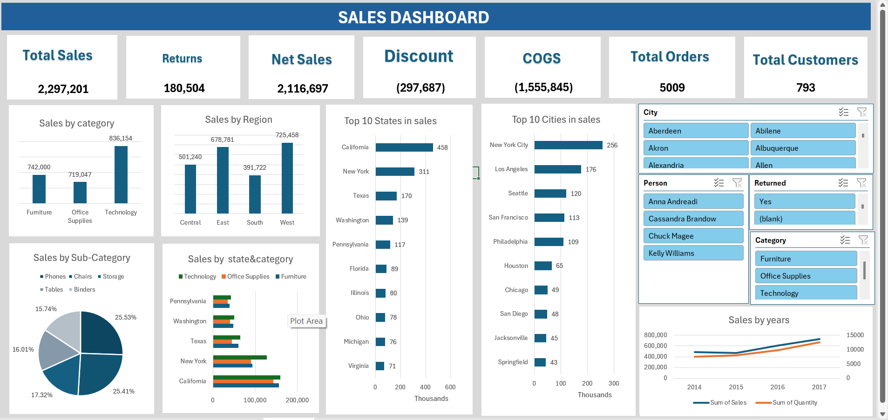

# SalesDashboard_Omar

A dynamic sales dashboard created using Microsoft Excel and Power Query.  
This project showcases how to clean, model, and analyze sales data using built-in Excel tools.

## 📊 Project Highlights:
- ✅ Cleaned and transformed raw data using **Power Query**
- ✅ Built table relationships with **Power Pivot**
- ✅ Created calculated columns (e.g., Discount Value, COGS)
- ✅ Designed KPI visuals: Net Sales, Profit, Quantity Sold
- ✅ Used **Pivot Tables & Charts** for dynamic reporting
- ✅ Focused analysis based on Region, Shipping Mode, Segment, and Category

## 🛠 Tools Used:
- Microsoft Excel  
- Power Query  
- Power Pivot  

## 📷 Dashboard Preview:

🎥 Check out a short demo video of the dashboard [here](https://drive.google.com/file/d/1R9OWgYrObtaC-8aCpKl0uuX-8ZIvGNY-/view?usp=sharing).

